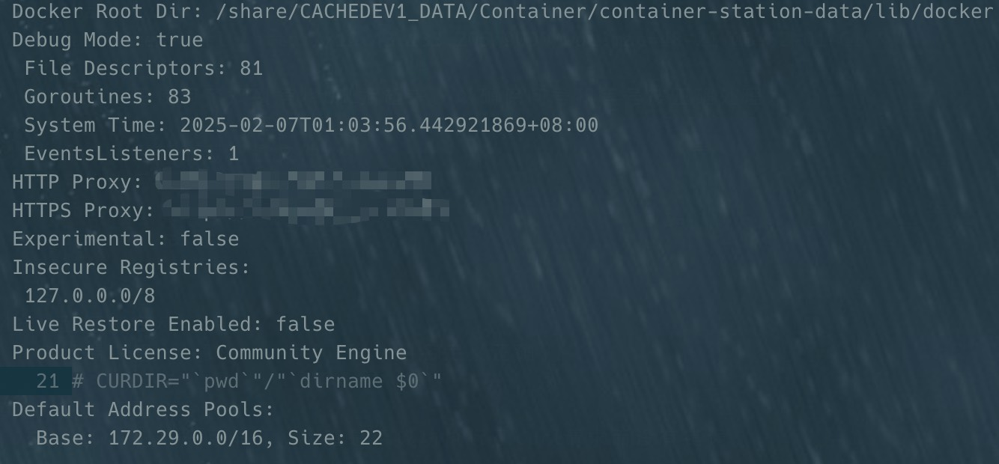

威联通 Docker 国内无法拉取镜像？

<!--truncate-->

## 背景

由于众所周知的原因，国内拉取 docker 镜像愈发可困难，网上现有的教程涉及 NAS 的极少，为了能愉快的使用 NAS，我进行了大量尝试，终于找到了可用的方法，顺手记录下，分享给各位苦苦挣扎的道友。

## 常见的方案

现有环境下，想成功拉取镜像，无非使用魔法或者换国内镜像。

### 使用代理

1. 开启威联通 ssh 服务,并通过 ssh 连接到 QNAP

```bash
# 远程登录
ssh -p 22 username@192.168.0.155
```

:::tip
SSH 服务的默认端口是 22，上述命令是 用户通过 SSH 工具用账号（username）连接到服务器（192.168.0.155）的 22 端口
:::

2. 增加 docker 的代理配置

```bash
# 编辑配置文件
sudo vim /share/CACHEDEV1_DATA/.qpkg/container-station/etc/docker.json
```

增加代理配置如下

```json
{
  // 新增配置
  "proxies": {
    "http-proxy": "http://代理地址:端口",
    "https-proxy": "http://代理地址:端口",
    "no-proxy": "*.test.example.com,.example.org,127.0.0.0/8"
  }
}
```

:::tip
ssh 登录后，可以通过 `which docker`、`whereis docker` 查看 docker 所在位置
:::

3. 重启 docker 服务

```bash
sudo /etc/init.d/container-station.sh restart
```

4. 查看配置是否成功

```bash
docker info
```

如下图：


完成上述设置后，你就可以愉快的拉取镜像了

### 更换国内镜像源

> 参考**使用代理**，增加镜像源配置

步骤 1、2 参考[使用代理](#使用代理)

```
# 编辑配置文件
sudo vim /share/CACHEDEV1_DATA/.qpkg/container-station/etc/docker.json
```

增加镜像源配置如下

```json
{
  // 新增配置
  "registry-mirrors": [
    "https://mirror.ccs.tencentyun.com",
    "https://docker.mirrors.ustc.edu.cn"
  ]
}
```

:::tip
腾讯云镜像加速器地址：https://mirror.ccs.tencentyun.com

中国科学技术大学：https://docker.mirrors.ustc.edu.cn

Docker 官方镜像（中国区）镜像加速：https://registry.docker-cn.com

网易云镜像加速器地址：http://hub-mirror.c.163.com

南京大学镜像加速器地址：https://docker.nju.edu.cn
:::

剩余步骤参考[使用代理](#使用代理)
